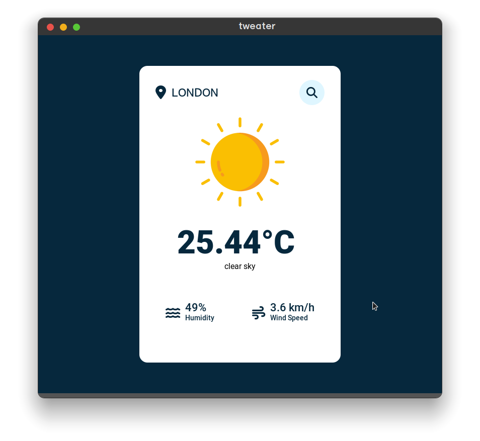

<div align="center">

# Tweater

*An weather app written in ClojureScript + Tauri*



</div>

## Introduction
- This is a project just for fun, I want to know about the possibility of integrating ClojureScript with tauri :)

- I don't have any Clojure foundation before this, so the code quality will be very poor, sorry :(

## Build and Run
```
Commands available via "pnpm run":
  dev
    shadow-cljs watch app
  build
    shadow-cljs release app
  shadow-cljs
    shadow-cljs
  tauri
    tauri
```

## Preview

<div align="center">


</div>

## Thanks for
- [100-days-of-javascript](https://github.com/AsmrProg-YT/100-days-of-javascript)
- [tauri-clojure-template](https://github.com/rome-user/tauri-clojurescript-template)

## License
The MIT License (MIT)

Copyright (c) 2023 Muqiu Han

Permission is hereby granted, free of charge, to any person obtaining a copy
of this software and associated documentation files (the "Software"), to deal
in the Software without restriction, including without limitation the rights
to use, copy, modify, merge, publish, distribute, sublicense, and/or sell
copies of the Software, and to permit persons to whom the Software is
furnished to do so, subject to the following conditions:

The above copyright notice and this permission notice shall be included in all
copies or substantial portions of the Software.

THE SOFTWARE IS PROVIDED "AS IS", WITHOUT WARRANTY OF ANY KIND, EXPRESS OR
IMPLIED, INCLUDING BUT NOT LIMITED TO THE WARRANTIES OF MERCHANTABILITY,
FITNESS FOR A PARTICULAR PURPOSE AND NONINFRINGEMENT. IN NO EVENT SHALL THE
AUTHORS OR COPYRIGHT HOLDERS BE LIABLE FOR ANY CLAIM, DAMAGES OR OTHER
LIABILITY, WHETHER IN AN ACTION OF CONTRACT, TORT OR OTHERWISE, ARISING FROM,
OUT OF OR IN CONNECTION WITH THE SOFTWARE OR THE USE OR OTHER DEALINGS IN THE
SOFTWARE.